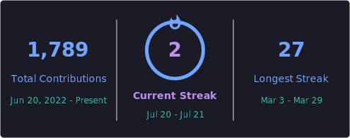
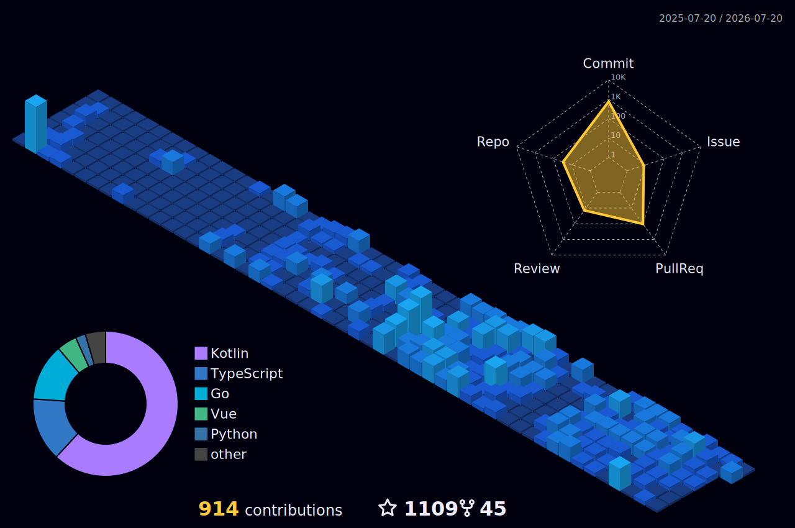

  
  

## 🙋 About Me

- 💻 Server-side developer & full-stack engineer — building backend services with **Java / Go**, plus **Vue / TypeScript** on the front end
- 🛠️ I enjoy building automation tools, proxies, and infrastructure
- 🌱 Currently exploring distributed systems, performance tuning & system design

## 🧰 Tech Stack

## 📊 GitHub Stats

## 📈 Contribution Graph

